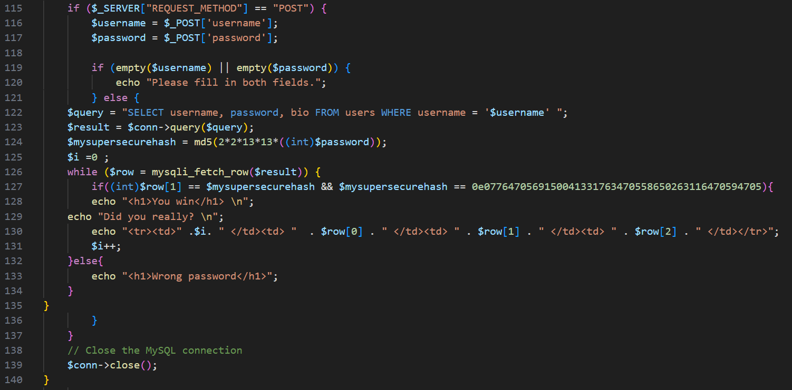

# BackdoorCTF 2023
## web/too-many-admins [p1r4t3]

As we can see on the picture below - there is a <b>'src'</b> GET-parameter that shows source code in response HTML-page. To make it work we need to pass any value to <b>'src'</b> GET-parameter (on picture below we see condition <b>'if ($srcparam) {...}'</b>).

Okay. Lets analyze the code further. As we can see on the picture below - there is a <b>'user'</b> GET-parameter that shows any user. We can pass certain username or pass <b>'all'</b> to get all accounts. But if you look closely at line 95, you will notice the possibility of SQL-injection (<b>'user'</b> GET-parameter). This will come in handy in the future.

As a result, we get a table with username and password (md5-hash) columns.

Now lets talk about the last remaining lines.

We can pass <b>'username'</b> and <b>'password'</b> POST-parameters for authorisation.
 

Further we see that password we passed is hashed by <b>'md5'</b>. But not just hashed, but multiplied by 2\*2\*13\*13 and only then passed to the <b>'md5()'</b> function.
 

Here we should make a lyrical digression and say why php should suck. If <b>'md5()'</b> returns a hash which starts with the number, then when casting to <b>'int'</b> it will be trimmed to the first non-numeric character (see on picture below).

That's what the attack is based on.
 

There our SQL-query to get user data with username we passed will be executed and further <b>'row'</b> will be iterate on results row.
 

If we take a close look at the condition on the line 127, we can notice that we will win if following two conditions will be fulfilled:
1. Password (aka <b>'row[1]'</b> on SQL-response) will be equal to hashed value.
2. Hashed value will be equal to 0. Why 0? Remember what I said earlier (0e... -> trim to 'e' -> 0).

It's a difficult task to bruteforce a password. Therefore we use a little hack: in our users table we can see some accounts password hashes of which are started with 0e (or 0, or letter, because all it ways give the null value). It means that we can use the password the md5-hash of which started from 0e (for example - <b>'240610708'</b> give <b>'0e462097431906509019562988736854'</b> hash). But on the 124 line we can see that our password are multiplied to 2\*2\*13\*13 and then passed to md5-function. Lets calculate: 240610708 \/ \(2 \* 2 \* 13 \* 13\) = 355933 -> this password we need to use.
 

For example lets sign in to the <b>'admin7'</b> account (it hash started with 0e).

Ta-daam! But now we need to understand that admin stores the flag. On SQL-code below we see that one of a bunch of admins keeps the flag.

To determine the necessary admin we use SQL-injection I mention in the beginning.
It's actually quite simple: <b>'34.132.132.69:8000/?user=admin0' OR bio LIKE "Flag{%" -- -'</b>
 

Now sign in with <b>'admin343/355933'</b> credentials.

Congratulations!